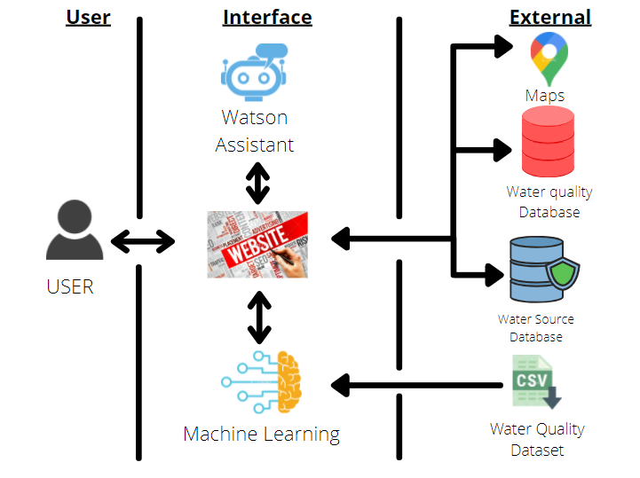
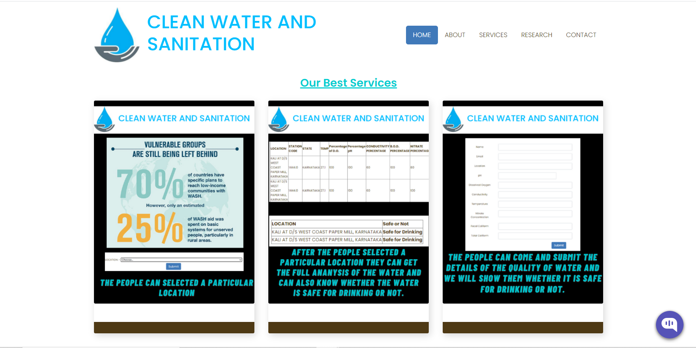
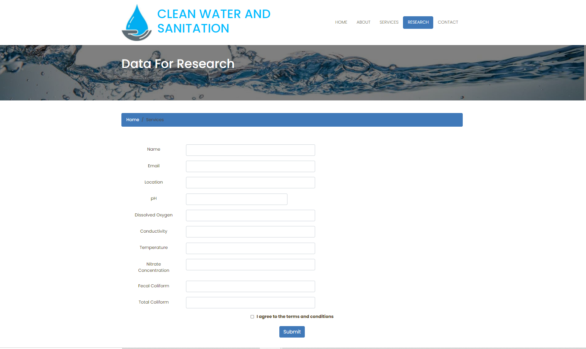
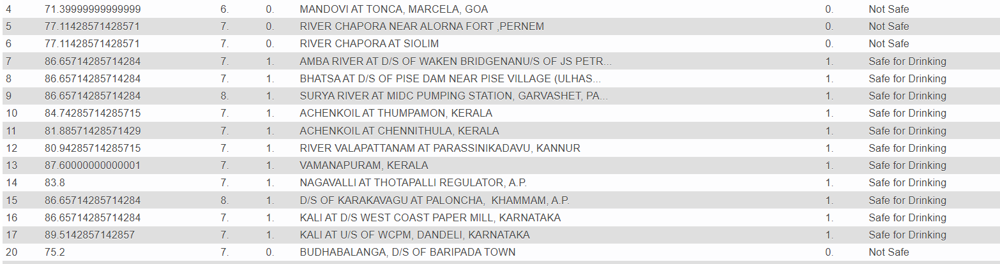

We have created a Website which will give a detailed water quality analysis. The youtube link of our demo video is-https://youtu.be/cx9JUjvufBo
The roadmap of our project is   

  
The first page of our website tell us the services provided. 
  
We have predicted whether the water is safe or not by training a machine learning model(Random Forest Classifier) and the data from the database provided by the user in form 1 will also be predicted. 
&nbsp;&nbsp;
  
THe database which contains all the data is given below:-  

 
Please import the db files in MYSQL and then use the folder.
